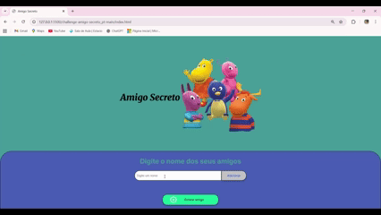

# 🎲 Jogo do Amigo Secreto  

Projeto desenvolvido como parte do **Challenge de Iniciante em Programação - Alura + Oracle ONE**.  
O objetivo é aplicar os fundamentos de **lógica de programação** em JavaScript, simulando o famoso sorteio de “Amigo Secreto”.

---

## 📌 Funcionalidades
- ➕ **Adicionar amigos** em uma lista.  
- 📝 **Exibir a lista** completa de participantes.  
- 🎰 **Sortear um amigo aleatoriamente**.  
- 🚫 Validação de entrada: impede nomes vazios ou duplicados.  

---

## 🧠 Conceitos trabalhados
- Declaração e manipulação de **arrays**.  
- Criação de **funções reutilizáveis**.  
- Uso de **condicionais (if/else)**.  
- Estruturas de **repetição (loops)**.  
- Geração de valores aleatórios com `Math.random()`.  

---

## 📸 Demonstração  

---

## ▶️ Como jogar
1. Abra o https://sorteio-amigo-secreto-one-nine.vercel.app/ no navegador.  
2. Digite o nome de cada participante no campo de texto e clique em **Adicionar**.  
3. Confira a lista de amigos que vai sendo formada abaixo.  
4. Clique em **Sortear** e veja quem foi o amigo secreto escolhido! 🎉
